```mermaid
flowchart TB
    subgraph Inputs ["1. Empirical Inputs (Zero External Ground Truth)"]
        direction TB
        in_ref["Empirical Reference Multiomics<br/>(scRNA-seq, scATAC-seq, CITE-seq, scMethylome)"]
        in_sim["Simulated Multiomics Profiles<br/>(Generated by Candidate Simulators)"]
        in_meta["Cell & Experimental Metadata<br/>(Cell Types, Batches / Donors)"]
        in_scal["Computational Resource Logs<br/>(Elapsed Time, Peak RAM)"]
    end

    subgraph Engines ["2. Core Evaluation Modules (62 Ground-Truth-Free Metrics)"]
        direction TB
        subgraph Cat1 ["(I) Distributional Properties"]
            m_dist["1D & 2D Distances: KS, Wasserstein, MAD, MAE, RMSE, Overlap, Bhattacharyya, ECDF, Runs Test<br/>Manifold Divergence: MMD, Frechet Distance (FSD)<br/>Model Fit: Model AIC/BIC, Marginal AIC/BIC, LRT"]
        end
        subgraph Cat2 ["(II) Correlations & Zero-Inflation"]
            m_corr["Biological CV (BCV), Logistic Dropout Curve (x0, beta1, R2)<br/>Posterior Excess Zero Weights (zingeR), Kinetic Noise (SymSim)<br/>Accessibility-Sparsity Polynomial Fit (simATAC)"]
        end
        subgraph Cat3 ["(III) Cellular Structure & Concordance"]
            m_cell["Separation: Silhouette (ASW), Dunn, Davies-Bouldin, Calinski-Harabasz, Connectivity<br/>Concordance: ARI, NMI, AMI, FMI, Homogeneity, Completeness, V-Measure, Hungarian Accuracy<br/>Manifold Fidelity: Neighborhood Purity, CDI, Generative Precision & Recall"]
        end
        subgraph Cat4 ["(IV) Batch Effects & Confounder Mixing"]
            m_batch["Cell-Specific Mixing Score (CMS), Local Density Factor (ldfDiff), Seurat Mixing Metric<br/>Local Inverse Simpson Index (LISI), PC Regression (PCR), Shannon Entropy<br/>Cross-Batch Cell Identity Transfer Accuracy & F1 Score"]
        end
        subgraph Cat5 ["(V) Biological Signal & Downstream Fidelity"]
            m_sig["SimBench 5 Signals: DE (Mean Shift), DV (Variance), DD (Distribution), DP (Dropout), BD (Bimodal)<br/>Cell Identity Predictive Classification Accuracy & F1<br/>Delta Variance Pseudoreplication Bias, Cell-Type Mixture Deconvolution RMSE & JSD"]
        end
        subgraph Cat6 ["(VI) Trajectory & Lineage Dynamics"]
            m_traj["scRNA-seq Inferred Geodesic Pseudotime Correlation<br/>scRNA-seq Inferred Lineage Tree Branch Height Discrepancy (RMSE)"]
        end
        subgraph Cat7 ["(VII) Cross-Modal Coupling & Modularity"]
            m_cross["Cross-Modality Feature Correlation (MAD, KS, Wasserstein)<br/>Cross-Modal Cell-Type Label Prediction Accuracy<br/>Joint Space Cell Alignment (FOSCTTM, Match@1)<br/>Regulatory Coupling, Peak Co-Accessibility (RV Coefficient), Co-Expression Modules"]
        end
        subgraph Cat8 ["(VIII) Computational Scalability"]
            m_scal["Elapsed Wall-Clock Time (sec), Peak RAM Allocation (MiB)"]
        end
    end

    subgraph Pipeline ["3. Unified Flagship Orchestration"]
        orch["evaluate_multiomics_accuracy() / evaluate_simulation_accuracy() / evaluate_multiple_datasets()"]
    end

    subgraph Outputs ["4. Benchmark Outputs & Downstream Decision"]
        out_table["Tidy Benchmark Summary Table<br/>(360+ Evaluated Metric Instances across Modalities)"]
        out_rank["Simulator Ranking & Comparative Leaderboard"]
        out_viz["Publication-Ready Comparative Plots & Heatmaps"]
    end

    Inputs --> Pipeline
    Pipeline --> Engines
    Engines --> Pipeline
    Pipeline --> Outputs

    style Inputs fill:#f0f4f8,stroke:#1d4ed8,stroke-width:2px
    style Engines fill:#faf5ff,stroke:#7c3aed,stroke-width:2px
    style Pipeline fill:#ecfdf5,stroke:#059669,stroke-width:3px
    style Outputs fill:#fffbeb,stroke:#d97706,stroke-width:2px
```

# scSimEval: Unified Benchmarking and Accuracy Evaluation for Single-Cell Multiomics Simulation Methods

`scSimEval` is a user-friendly R package designed to evaluate and benchmark **single-cell and multiomics data simulation methods** (such as scRNA-seq, scATAC-seq, CITE-seq, and single-cell methylation).

Many benchmarking tools require artificial "ground truth" (such as preset lists of marker genes or external gene network databases) that are rarely known in real biological experiments. In contrast, `scSimEval` uses **62 easy-to-understand evaluation metrics organized across 8 clear categories**. It works directly with the experimental data you already have, without requiring any external ground truth:

1. **Real reference data** (`ref_rna`, `ref_atac`, CITE-seq ADT, or methylation $\beta$-values)
2. **Simulated data** (`sim_rna`, `sim_atac`, CITE-seq ADT, or methylation $\beta$-values)
3. **Cell type labels** (`cell_types`)
4. **Batch or donor details** (`batch_info`)
5. **Computer resources** (Runtime in seconds and peak RAM in MiB)
6. **Developmental trajectories** (automatically learned directly from scRNA-seq counts)

---

## Overview & Workflow Architecture

<p align="center">
  
</p>

<details>
<summary>Click here to view Mermaid Workflow Specification</summary>



</details>

---

## Metric Taxonomy: The 8 Canonical Categories (62 Selected Measures)

| # | Canonical Category | Measure Name | Mathematical Formulation | Scientific Interpretation / Biological Target | Minimum Input Requirements |
|:---:|:---|:---|:---|:---|:---|
| **1** | (I) Distributional | **Kolmogorov–Smirnov Distance (1D KS)** | $D = \sup_t |F_{\text{ref}}(t) - F_{\text{sim}}(t)|$ | Maximum vertical divergence between empirical cumulative distributions | Reference & simulated counts |
| **2** | (I) Distributional | **1D Wasserstein Distance ($\mathcal{W}_1$)** | $\int_0^1 |F_{\text{ref}}^{-1}(u) - F_{\text{sim}}^{-1}(u)| du$ | Earth Mover's Distance / physical transport cost | Reference & simulated counts |
| **3** | (I) Distributional | **Median Absolute Deviation (MAD)** | $\text{median}(|x_{(i)} - y_{(i)}|)$ | Quantile-aligned median location discrepancy | Reference & simulated counts |
| **4** | (I) Distributional | **Mean Absolute Error (MAE)** | $\frac{1}{N}\sum |x_{(i)} - y_{(i)}|$ | Mean $L_1$ absolute error across quantile bins | Reference & simulated counts |
| **5** | (I) Distributional | **Root Mean Squared Error (RMSE)** | $\sqrt{\frac{1}{N}\sum (x_{(i)} - y_{(i)})^2}$ | Quadratic $L_2$ distance penalizing tail errors | Reference & simulated counts |
| **6** | (I) Distributional | **Density Overlap ($\text{OV}$)** | $\int \min(f_{\text{ref}}(t), f_{\text{sim}}(t)) dt$ | Shared probability mass under KDE curves ($[0, 1]$) | Reference & simulated counts |
| **7** | (I) Distributional | **Bhattacharyya Distance ($D_B$)** | $-\ln \int \sqrt{f_{\text{ref}}(t) f_{\text{sim}}(t)} dt$ | Geometric affinity / probability profile overlap | Reference & simulated counts |
| **8** | (I) Distributional | **Empirical CDF Difference Area** | $\int |F_{\text{ref}}(t) - F_{\text{sim}}(t)| dt$ | Total integrated area between empirical CDFs | Reference & simulated counts |
| **9** | (I) Distributional | **Wald–Wolfowitz Runs Test** | $Z = \frac{R - E[R]}{\sigma_R}$ | Non-parametric test of mutual sequence randomness | Reference & simulated counts |
| **10** | (I) Distributional | **2D Fasano–Franceschini KS** | Range-tree quadrant supremum on 2D pairs | Bivariate feature-coupling distribution divergence | Reference & simulated counts |
| **11** | (I) Distributional | **2D Peacock Test** | Uniform-angle radial quadrants test | Bivariate goodness-of-fit across non-linear pairs | Reference & simulated counts |
| **12** | (I) Distributional | **2D Bivariate KDE $z$-Statistic** | Permutation test on 2D density grid | Discrepancy between 2D continuous expression surfaces | Reference & simulated counts |
| **13** | (I) Distributional | **Maximum Mean Discrepancy (MMD)** | $\|\mu_P - \mu_Q\|_{\mathcal{H}_k}^2$ | Kernel manifold distance on high-dimensional cells | Reference & simulated counts |
| **14** | (I) Distributional | **Fréchet Single-Cell Distance (FSD)**| $\|\mu_1 - \mu_2\|^2 + \text{Tr}(\Sigma_1 + \Sigma_2 - 2\sqrt{\Sigma_1\Sigma_2})$ | Wasserstein-2 distance on multivariate PCA embeddings | Reference & simulated counts |
| **15** | (II) Correlations | **Biological Coeff. of Variation (BCV)**| $\sqrt{\phi}$ from Negative Binomial dispersion | Biological vs technical variance overdispersion | Reference & simulated counts |
| **16** | (II) Correlations | **Dropout Midpoint ($x_0$)** | Logistic midpoint: $P_0(x_0) = 0.5$ | Expression threshold where 50% dropouts occur | Reference & simulated counts |
| **17** | (II) Correlations | **Dropout Decay Slope ($k$)** | Logistic steepness $\beta_1$ in $\text{logit}(P_0)$ | Kinetics of zero-inflation dropout rate decay | Reference & simulated counts |
| **18** | (II) Correlations | **Mean-Variance Fit ($R^2$)** | Polynomial overdispersion curve fit | Goodness-of-fit for biological overdispersion | Reference & simulated counts |
| **19** | (II) Correlations | **Cell-Cell Correlation Distance** | Frobenius discrepancy on cell correlation matrix | Preservation of pairwise cellular manifold distances | Reference & simulated counts |
| **20** | (II) Correlations | **Gene-Gene Correlation Distance** | Frobenius discrepancy on gene co-expression matrix | Preservation of transcriptional regulatory networks | Reference & simulated counts |
| **21** | (III) Cellular | **Average Silhouette Width (ASW)** | $\frac{1}{N}\sum \frac{b(i) - a(i)}{\max(a(i), b(i))}$ | Cluster compactness and biological separation | Counts + Cell types |
| **22** | (III) Cellular | **Dunn Index** | $\frac{\min_{i \neq j} d(C_i, C_j)}{\max_k \text{diam}(C_k)}$ | Ratio of inter-cluster separation to intra-cluster diameter | Counts + Cell types |
| **23** | (III) Cellular | **Davies–Bouldin Index** | $\frac{1}{k}\sum \max_{j \neq i} \frac{s_i + s_j}{d(c_i, c_j)}$ | Cluster compactness relative to cluster separation | Counts + Cell types |
| **24** | (III) Cellular | **Calinski–Harabasz Index** | $\frac{\text{Tr}(B_k)/(k - 1)}{\text{Tr}(W_k)/(n - k)}$ | Variance ratio criterion for cluster compactness | Counts + Cell types |
| **25** | (III) Cellular | **Adjusted Rand Index (ARI)** | $\frac{\text{RI} - E[\text{RI}]}{\max(\text{RI}) - E[\text{RI}]}$ | Cluster partition agreement corrected for chance | Counts + Cell types |
| **26** | (III) Cellular | **Normalized Mutual Info (NMI)** | $\frac{2 I(U; V)}{H(U) + H(V)}$ | Information-theoretic cluster label concordance | Counts + Cell types |
| **27** | (III) Cellular | **Adjusted Mutual Info (AMI)** | $\frac{I(U; V) - E[I(U; V)]}{\max(H(U), H(V)) - E[I(U; V)]}$ | Mutual information adjusted for chance | Counts + Cell types |
| **28** | (III) Cellular | **$V$-Measure** | $\frac{2 \cdot h \cdot c}{h + c}$ | Harmonic mean of homogeneity ($h$) and completeness ($c$) | Counts + Cell types |
| **29** | (III) Cellular | **Neighborhood Purity** | $\frac{1}{k}\sum_{j \in N_k(i)} \mathbb{I}(y_j = y_i)$ | Fraction of $k$-nearest neighbors of the same cell type | Counts + Cell types |
| **30** | (III) Cellular | **Hungarian Matching Accuracy** | $\frac{1}{N}\sum \mathbb{I}(\pi^*(c_{\text{sim}}) = c_{\text{ref}})$ | Optimal bijective permutation concordance | Counts + Cell types |
| **31** | (IV) Batch Mixing | **CellMixS Score (CMS)** | Empirical $p$-value distribution smoothing | Local neighborhood batch-mixture uniformity | Counts + Batch info |
| **32** | (IV) Batch Mixing | **Batch Shannon Entropy** | $-\sum p_b \ln(p_b)$ in local cell neighborhoods | Uniformity of batch representation across cells | Counts + Batch info |
| **33** | (IV) Batch Mixing | **Principal Component Regression ($R^2$)**| $\sum R^2(PC_i \sim \text{Batch}) \cdot \text{Var}(PC_i)$ | Total variance explained by batch confounders | Counts + Batch info |
| **34** | (IV) Batch Mixing | **Seurat Mixing Metric** | Mean rank of $k$-th cell from the same batch | Local proximity mixing of batches in $k$-NN space | Counts + Batch info |
| **35** | (IV) Batch Mixing | **Local Inverse Simpson Index (LISI)**| $\frac{1}{\sum p_b^2}$ in local neighborhood | Effective number of batches mixed in cell neighborhoods | Counts + Batch info |
| **36** | (IV) Batch Mixing | **kBET Rejection Rate** | $\frac{1}{N}\sum \mathbb{I}(P_{\chi^2} < \alpha)$ | Fraction of neighborhoods with rejected batch mixing | Counts + Batch info |
| **37** | (IV) Batch Mixing | **Local Density Factor Diff ($\text{ldfDiff}$)**| $\frac{1}{n}\sum |\text{LDF}_{\text{batch}}(i) - \text{LDF}_{\text{overall}}(i)|$ | Preservation of local manifold density across batches | Counts + Batch info |
| **38** | (V) Biological Signal | **SimBench SMAPE** | $\frac{1}{M}\sum \frac{|\text{Prop}_{\text{ref}} - \text{Prop}_{\text{sim}}|}{\text{Prop}_{\text{ref}} + \text{Prop}_{\text{sim}}}$ | Symmetric mean absolute percentage error in DE proportions | Counts + Cell types |
| **39** | (V) Biological Signal | **SimBench DE Fidelity Score** | $1 - \text{SMAPE}$ | Overall concordance in preserving differential signals ($[0, 1]$) | Counts + Cell types |
| **40** | (V) Biological Signal | **$\log_2\text{FC}$ Pearson Correlation** | $\frac{\text{Cov}(\log_2\text{FC}_{\text{ref}}, \log_2\text{FC}_{\text{sim}})}{\sigma_{\text{ref}} \sigma_{\text{sim}}}$ | Linear effect-size preservation across all genes | Counts + Cell types |
| **41** | (V) Biological Signal | **$\log_2\text{FC}$ Spearman Correlation** | $\rho(\text{rank}(\log_2\text{FC}_{\text{ref}}), \text{rank}(\log_2\text{FC}_{\text{sim}}))$ | Monotonic effect-size preservation ranking | Counts + Cell types |
| **42** | (V) Biological Signal | **Top DEG Jaccard Overlap** | $\frac{|S_{\text{ref}}^{(N)} \cap S_{\text{sim}}^{(N)}|}{|S_{\text{ref}}^{(N)} \cup S_{\text{sim}}^{(N)}|}$ | Intersection-over-union of top $N$ prioritized DEGs | Counts + Cell types |
| **43** | (V) Biological Signal | **True DEG Ratio** | $\frac{N_{\text{sim\_DEG}}}{N_{\text{ref\_DEG}}}$ | Ratio of discovered DEGs (sensitivity vs specificity) | Counts + Cell types |
| **44** | (V) Biological Signal | **$P$-Value Uniformity ($\chi^2$)** | $\sum_{k=1}^B \frac{(O_k - E_k)^2}{E_k}$ on null $P$-values | Absence of false positive inflation under the null hypothesis | Counts + Cell types |
| **45** | (V) Biological Signal | **Distribution Score** | $\mathbb{I}(P_{\chi^2} > 0.05)$ | Binary flag for valid, well-calibrated null $p$-values | Counts + Cell types |
| **46** | (V) Biological Signal | **Classifier Accuracy** | $\frac{\text{TP} + \text{TN}}{\text{Total Cells}}$ | Machine learning cell identity predictability | Counts + Cell types |
| **47** | (V) Biological Signal | **Classifier Macro-$F_1$** | $\frac{1}{K}\sum_{k=1}^K F_{1,k}$ | Harmonic mean of precision and recall across rare types | Counts + Cell types |
| **48** | (V) Biological Signal | **Classifier Macro-Recall** | $\frac{1}{K}\sum_{k=1}^K \text{Recall}_k$ | Balanced sensitivity across all cell types | Counts + Cell types |
| **49** | (V) Biological Signal | **Simulated Silhouette (ASW)** | $\frac{1}{N}\sum \frac{b(i) - a(i)}{\max(a(i), b(i))}$ on groups | Cluster tightness between biological conditions | Counts + Cell types |
| **50** | (V) Biological Signal | **Silhouette Discrepancy** | $|\text{ASW}_{\text{ref}} - \text{ASW}_{\text{sim}}|$ | Fidelity of biological condition separation | Counts + Cell types |
| **51** | (V) Biological Signal | **Simulated Group PVE** | $\frac{\text{SS}_{\text{between}}}{\text{SS}_{\text{total}}}$ | Proportion of variance explained by biological group | Counts + Cell types |
| **52** | (V) Biological Signal | **Group PVE Discrepancy** | $|\text{PVE}_{\text{ref}} - \text{PVE}_{\text{sim}}|$ | Preservation of group-level effect size in PCA space | Counts + Cell types |
| **53** | (VI) Trajectory | **Geodesic Pseudotime Correlation** | $\text{Cor}(\tau_{\text{ref}}, \tau_{\text{sim}})$ (Kendall's $\tau$) | Concordance of developmental progression ordering | Counts (+ Pseudotime) |
| **54** | (VI) Trajectory | **Lineage Tree Height Discrepancy** | $\sqrt{\frac{1}{M}\sum (h_{\text{ref}, m} - h_{\text{sim}, m})^2}$ | Preservation of differentiation hierarchy branch lengths | Counts (+ Tree) |
| **55** | (VII) Cross-Modal | **Feature-Level Cross-Correlation** | $\text{Cor}(X_{\text{RNA}}, Y_{\text{ATAC}})$ | Coupled cross-omics correlation preservation | Paired multiomics counts |
| **56** | (VII) Cross-Modal | **Cross-Modal Label Transfer Acc.** | $\frac{1}{N}\sum \mathbb{I}(\hat{y}_{\text{ATAC}\to\text{RNA}} = y)$ | Cell identity transfer across uncoupled omics layers | Paired multiomics counts |
| **57** | (VII) Cross-Modal | **FOSCTTM Score** | Fraction of samples closer to target than true match | Global cross-modal manifold alignment accuracy | Paired multiomics counts |
| **58** | (VII) Cross-Modal | **$\text{Match@1}$ Rate** | Proportion of cells exactly matched to true pairing | Cellular-level multiomics pairing precision | Paired multiomics counts |
| **59** | (VII) Cross-Modal | **Peak-to-Gene RV Coefficient ($R_V$)**| $\frac{\text{Tr}(X X^T Y Y^T)}{\sqrt{\text{Tr}((X X^T)^2)\text{Tr}((Y Y^T)^2)}}$ | Matrix correlation between RNA and ATAC spaces | Paired multiomics counts |
| **60** | (VII) Cross-Modal | **Epigenomic Accessibility AUC** | $\text{ROC-AUC}(Y_{\text{sim}} \mid Y_{\text{ref\_peak}})$ | Genomic region accessibility prediction fidelity | Paired multiomics counts |
| **61** | (VIII) Scalability | **Wall-Clock Elapsed Time** | Real execution time from launch to termination in seconds | End-to-end practical execution throughput | Process telemetry / logs |
| **62** | (VIII) Scalability | **Peak Memory Allocation** | Peak resident RAM consumption in mebibytes ($\text{MiB}$) | Memory footprint and HPC resource scalability | Process telemetry / logs |
---

## Modality Generalizability

The 62 selected measures natively extend to any single-cell multi-omics configuration:
1. **scRNA-seq + scATAC-seq** (Transcriptome + Chromatin Accessibility)
2. **CITE-seq / REAP-seq** (Transcriptome + Surface Protein Antibodies)
3. **scMethylome-seq** (Transcriptome + CpG $\beta$-values / Methylation Rates)
4. **scCUT&Tag / scChIP-seq** (Transcriptome + Histone Modifications)

---

## Quick Start Guide

### 1. Unimodal Evaluation (`evaluate_simulation_accuracy`)

```R
library(scSimEval)

# Load your reference and simulated count matrices (features x cells)
ref_rna <- matrix(rpois(1000 * 200, lambda = 3), nrow = 1000, ncol = 200)
sim_rna <- matrix(rpois(1000 * 200, lambda = 3), nrow = 1000, ncol = 200)
rownames(ref_rna) <- rownames(sim_rna) <- paste0("Gene_", 1:1000)
colnames(ref_rna) <- colnames(sim_rna) <- paste0("Cell_", 1:200)

# Run unimodal evaluation
res_unimodal <- evaluate_simulation_accuracy(
  ref_data = ref_rna,
  sim_data = sim_rna,
  compute_bivariate = TRUE
)

# View tidy summary table
head(res_unimodal$metrics_summary_table)
```

### 2. Full Multi-Omics Benchmarking Pipeline (`evaluate_multiomics_accuracy`)

```R
# Prepare paired multiomics objects
ref_multi <- list(rna = ref_rna, atac = ref_atac)
sim_multi <- list(rna = sim_rna, atac = sim_atac)

cell_types <- factor(rep(c("Type_A", "Type_B", "Type_C", "Type_D"), each = 50))
batch_info <- factor(rep(c("Batch_1", "Batch_2"), each = 100))

# Execute master benchmark across all 7 categories
res_multi <- evaluate_multiomics_accuracy(
  ref_multi = ref_multi,
  sim_multi = sim_multi,
  cell_types = cell_types,
  batch_info = batch_info,
  cpu_time = 14.8,    # Logged CPU seconds
  memory_mb = 342.5   # Logged Peak RAM in MB
)

# Access tidy master summary table
master_df <- res_multi$benchmark_summary_table
print(head(master_df, 20))
```

---


### 3. Simultaneous Multi-Method / Multi-Dataset Benchmarking & Consolidated Reporting (`evaluate_multiple_datasets`)

Benchmark an arbitrary collection of unimodal and paired multiomics datasets simultaneously:

```R
# Define multi-dataset collection (paired multiomics + solitary unimodal)
dataset_collection <- list(
  "Method 1-scRNA-seq" = list(ref = ref_rna, sim = sim_rna),
  "Method 1-scATAC-seq" = list(ref = ref_atac, sim = sim_atac),
  "Method 2-scRNA-seq" = list(ref = ref_rna, sim = sim_rna),
  "Method 2-scATAC-seq" = list(ref = ref_atac, sim = sim_atac),
  "Method 3-scATAC-seq" = list(ref = ref_atac, sim = sim_atac),
  "Method 4-scRNA-seq"  = list(ref = ref_rna, sim = sim_rna)
)

# Run batch evaluation (auto-pairs Method 1 and Method 2 for joint cross-modal evaluation)
consolidated <- evaluate_multiple_datasets(
  datasets = dataset_collection,
  pair_by_prefix = TRUE,
  compute_bivariate = FALSE
)

# Print consolidated summary
print(consolidated)

# Access consolidated master table (includes Dataset, Data_Name, Modality, Category, Property, Metric, Value)
head(consolidated$consolidated_summary_table)

# Plot multi-dataset comparative discrepancy across all cohorts
plot_consolidated_summary(
  consolidated_res = consolidated,
  category = "Distributional Properties",
  metric = "KS"
)
```

### 4. Publication Visualizations & Diagnostic Suite

`scSimEval` generates publication-ready figures conforming to Nature/Cell benchmarking standards at **600 DPI** using unnormalized raw scores:

- **Flagship Bubble Matrix (`plot_benchmark_bubble_matrix`)**: Renders all 62 evaluation measures across simulators in a unified multi-tier bubble matrix with 8 canonical category banner headers.
- **Evaluation Summary Bars (`plot_evaluation_summary`)**: Nature-style horizontal bar matrix ranking simulators with multi-panel category fidelity scores and an overall composite score.
- **Comparative Distribution QC (`plot_distribution_qc`)**: Multi-simulator kernel density overlays against the empirical reference (dashed black curve) with embedded Kolmogorov-Smirnov statistics ($D_{\text{KS}}$).
- **Metric Comparison Boxplots (`plot_metric_boxplots`)**: Raw-score boxplots with jittered data points showing distribution spread across simulators and evaluation categories.
- **Computational Scalability Suite (`plot_scalability_benchmark`)**: 6-panel or 4-panel dashboard evaluating runtime, peak memory, runtime-memory tradeoff Pareto frontier, multithreading parallel efficiency, computational cost footprint, and cell throughput.
- **Raw Metric Score Heatmap (`plot_metric_heatmap`)**: Method-by-metric grid printing exact unnormalized raw scores inside every cell.
- **Metric Multidimensional Scaling (`plot_metric_mds`)**: Classical 2D MDS ordination of simulation methods based on pairwise Euclidean metric distances.
- **Metric Principal Component Analysis (`plot_metric_pca`)**: PCA biplot showing simulator ordination and loading vectors for top discriminating metrics.

```R
# 1. Master benchmark bubble matrix
p_bubble <- plot_benchmark_bubble_matrix(
  data              = consolidated,
  method_classes    = list("Unimodal" = c("Method 3", "Method 4"), "Multiomics" = c("Method 1", "Method 2")),
  title             = "Benchmark Overview: Single-Cell Simulation Fidelity"
)

# 2. Executive evaluation summary horizontal bar matrix
p_summary <- plot_evaluation_summary(data = consolidated)

# 3. Multi-faceted computational scalability dashboard
p_scalability <- plot_scalability_benchmark(scalability_data = consolidated, mode = "composite", panels = "6panel")

# 4. Raw metric score matrix heatmap
p_heatmap <- plot_metric_heatmap(benchmark_data = consolidated, top_n_metrics = 12)

# 5. Metric MDS ordination & PCA biplot
p_mds <- plot_metric_mds(benchmark_data = consolidated)
p_pca <- plot_metric_pca(benchmark_data = consolidated)
```

### 5. Multi-Framework DEG & Biological Signal Fidelity (`evaluate_deg_fidelity`)

Evaluate the preservation of differentially expressed genes (DEGs) and biological signals between reference and simulated datasets across **Simpipe** (Duo et al., 2024), **SimBench** (Cao et al., 2021), and **Shaky Foundations** (Crowell et al., 2023):

```R
# Evaluate DEG fidelity between two cell groups
deg_res <- evaluate_deg_fidelity(
  ref_data              = ref_rna,
  sim_data              = sim_rna,
  ref_celltypes         = cell_types,
  sim_celltypes         = cell_types,
  group1                = "Type_A",
  group2                = "Type_B",
  fdr_cutoff            = 0.05,
  logfc_cutoff          = 0.5,
  top_n_de              = 100,
  classifier            = "knn",
  run_pvalue_uniformity = TRUE
)

# Inspect 15 multi-framework metrics
print(deg_res$deg_summary_table)

# Generate publication-ready effect-size scatter & multi-framework benchmark barplot
p_deg <- plot_deg_fidelity(deg_res)
print(p_deg)
```

#### Dual Bubble Matrix Visualization Paradigms for DEG Fidelity:

`scSimEval` supports two complementary ways to visualize DEG fidelity across simulators:

* **Option A: Master Bubble Matrix Integration (`plot_benchmark_bubble_matrix`)**
  All 15 DEG metrics are automatically registered under Category **`(V) Biological Signal & Downstream Fidelity`**. They can be displayed together with all other single-cell distributional, batch, and cluster properties in one comprehensive master benchmark figure:

```R
# Master bubble matrix displaying Category (V) DEG fidelity alongside standard metrics
p_master <- plot_benchmark_bubble_matrix(
  data  = all_benchmarks,
  title = "Comprehensive Single-Cell Benchmark (Distributional + DEG Fidelity)"
)
print(p_master)
```

* **Option B: Dedicated Multi-Framework DEG Bubble Matrix (`plot_deg_bubble_matrix`)**
  Generates a specialized multi-method comparison figure faceted horizontally across the three benchmark frameworks (**Simpipe**, **SimBench**, and **Shaky Foundations**). Bubble sizes automatically invert direction-dependent metrics (such as SMAPE, Silhouette discrepancy, and Chi-sq uniformity) so that **larger bubbles consistently denote superior fidelity**:

```R
# Dedicated multi-method DEG bubble matrix
deg_list <- list(
  "scDesign3" = deg_res_scd3,
  "Splatter"  = deg_res_splat,
  "SCRIP"     = deg_res_scrip
)

p_deg_bubble <- plot_deg_bubble_matrix(
  data              = deg_list,
  bubble_size_range = c(2, 9),
  title             = "Multi-Framework Differential Expression Benchmark"
)
print(p_deg_bubble)
```

### 6. Interactive Web Application (Shiny Studio) (`launch_scSimEval_app`)

Launch the built-in interactive Shiny studio to explore the 62 evaluation measures, customize category weighting, dynamically re-rank simulators, and export publication-quality figures:

```R
library(scSimEval)

# Launch locally in your default web browser
launch_scSimEval_app()

```

The Shiny studio includes:
- **Instant Demo Benchmark Mode:** Explore pre-computed benchmarks across 6 simulators with zero waiting time.
- **Dynamic Leaderboard:** Adjust custom weights across categories to inspect composite simulator rankings.
- **Flagship Bubble Matrix:** Interactively filter categories and download 600-DPI publication figures.
- **Diagnostic Explorers:** Inspect distribution density overlays, 2D PCA manifold projections, and scalability Pareto frontiers.

---

## Score Normalization in Benchmark Bubble Plots

To ensure that different metrics can be compared fairly on the same scale:

1. **Direction Inversion (Lower-is-Better Metrics):**
   For metrics where smaller numbers indicate better results (such as statistical distance, KS statistic, error, and runtime), scores are inverted:
   $$\text{Inverted Value} = \text{Maximum} - \text{Value}$$
   This ensures that larger numbers always mean better quality across all metrics.

2. **Min-Max Scaling ($0.00$ to $1.00$):**
   All metrics are rescaled to a standard range from $0.00$ (worst) to $1.00$ (best):
   $$\text{Standardized Score} = \frac{\text{Value} - \text{Minimum}}{\text{Maximum} - \text{Minimum}}$$

3. **Visual Encoding:**
   * **Bubble Size:** Larger bubbles indicate higher fidelity and better simulation accuracy.
   * **Glyph Shape:** Top-performing tools ($\ge 0.96$) are highlighted with bold squares, while standard scores are shown as circles.
   * **Bubble Color:** Blue for distributional distances, green for biological preservation, and orange for computer runtime.
   * **Leaderboard Ranking:** Simulation methods are ordered top-to-bottom on the vertical axis by their overall average score across all metrics.

---

## Authors & Maintainers

`scSimEval` is developed and maintained by:

* **Kabilan S** (Ph.D Student and Maintainer, ICAR-IASRI) - `kabilan151414@gmail.com`
* **Dr. Dwijesh Chandra Mishra** (Author & Thesis Guide, ICAR-IASRI) - `dwij.mishra@gmail.com`
* **Dr. Shashi Bhushan Lal** (Author, ICAR-IASRI) - `sblall16@gmail.com`
* **Dr. Sudhir Srivastava** (Author, ICAR-IASRI) - `sudhir0401bm@gmail.com`
* **Dr. Krishna Kumar Chaturvedi** (Author, ICAR-IASRI) - `kkcchaturvedi@gmail.com`
* **Dr. Sharanbasappa** (Contributor, ICAR-IASRI) - `smadival509@gmail.com`

### Citation

If you use `scSimEval` in your research, please cite:
> Kabilan S, Dwijesh Chandra Mishra, Shashi Bhushan Lal, Sudhir Srivastava, Krishna Kumar Chaturvedi, Sharanbasappa (2026). **scSimEval: Unified Benchmarking and Accuracy Evaluation for Single-Cell Multiomics Simulation Methods**. R package version 0.6.0.

---

## License

MIT License. Developed for research in single-cell multiomics simulation benchmarking.
