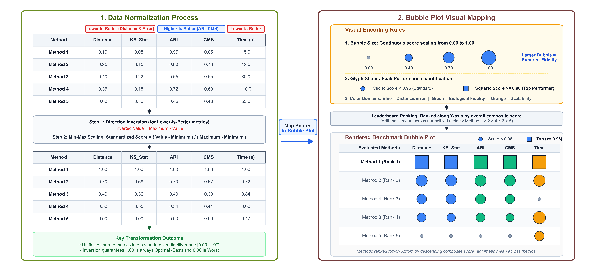
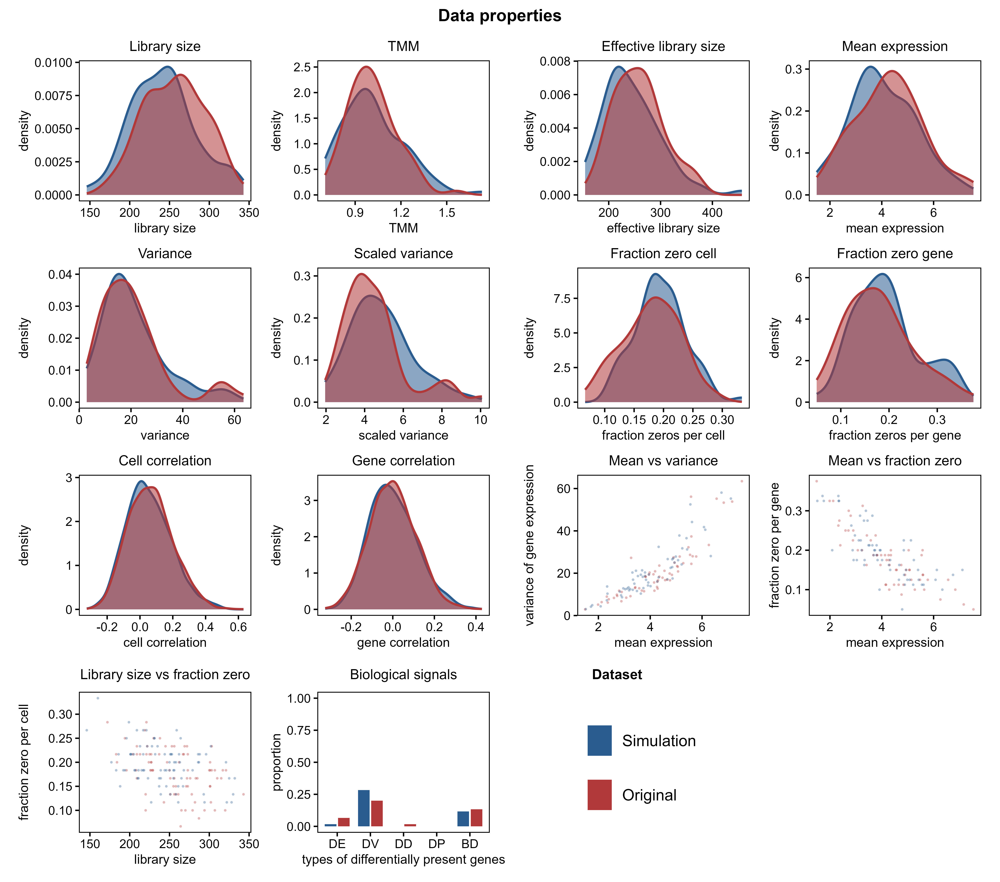
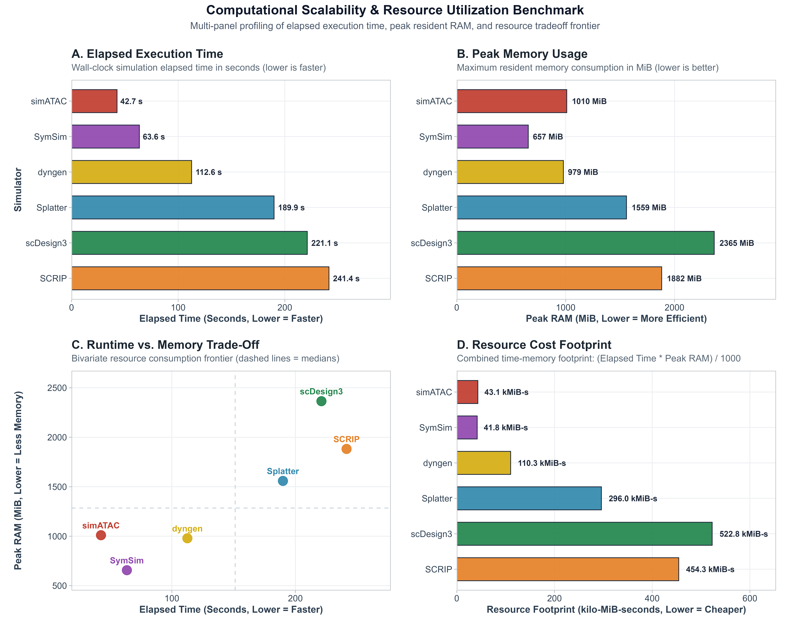
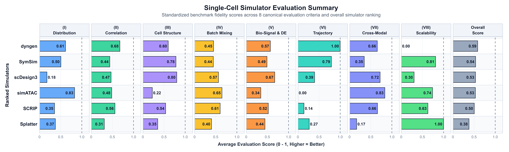
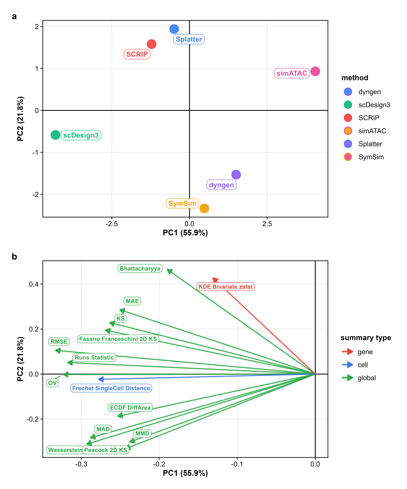

<style>
@import url('https://fonts.googleapis.com/css2?family=Inter:wght@300;400;500;600;700&family=JetBrains+Mono:wght@400;500&display=swap');

body {
  font-family: 'Inter', -apple-system, BlinkMacSystemFont, "Segoe UI", Roboto, "Helvetica Neue", Arial, sans-serif;
  font-size: 15px;
  line-height: 1.5;
  color: #24292f;
  text-align: justify;
  text-justify: inter-word;
  max-width: 1200px;
  margin: 0 auto;
  padding: 2.2em 2em;
  background-color: #ffffff;
}

p, li {
  line-height: 1.5;
  text-align: justify;
  text-justify: inter-word;
  margin-bottom: 1em;
}

h1, h2, h3, h4, h5, h6 {
  font-family: 'Inter', -apple-system, BlinkMacSystemFont, "Segoe UI", Roboto, "Helvetica Neue", Arial, sans-serif;
  font-weight: 600;
  color: #0f172a;
  text-align: left;
  margin-top: 1.6em;
  margin-bottom: 0.6em;
  line-height: 1.3;
}

h1 {
  font-size: 2.1em;
  border-bottom: 2px solid #e2e8f0;
  padding-bottom: 0.35em;
}

h2 {
  font-size: 1.45em;
  border-bottom: 1px solid #f1f5f9;
  padding-bottom: 0.25em;
  color: #1e293b;
}

h3 {
  font-size: 1.2em;
  color: #334155;
}

h4.author, .author {
  display: inline-block;
  font-size: 1.05em;
  font-weight: 500;
  color: #334155;
  margin-right: 0.5em;
  margin-top: 0.3em;
  margin-bottom: 0.3em;
}

h4.date, .date {
  font-size: 0.95em;
  color: #64748b;
  margin-top: 0.2em;
  margin-bottom: 1.5em;
}

#TOC {
  border: 1px solid #cbd5e1;
  border-radius: 8px;
  padding: 1.4em 2.2em;
  background-color: #f8fafc;
  margin: 1.8em 0 2.5em 0;
  width: 100%;
  box-sizing: border-box;
}

#TOC > ul {
  padding-left: 0.5em;
  list-style: none;
}

#TOC ul {
  padding-left: 1.5em;
  margin-top: 0.25em;
  margin-bottom: 0.25em;
}

#TOC li {
  margin-bottom: 0.4em;
  line-height: 1.5;
  text-align: left;
}

#TOC a {
  text-decoration: none;
  color: #1e40af;
  font-weight: 500;
}

#TOC a:hover {
  text-decoration: underline;
  color: #1d4ed8;
}

code, pre {
  font-family: 'JetBrains Mono', Consolas, Monaco, 'Courier New', monospace;
  font-size: 13.5px;
}

pre {
  background-color: #f8fafc;
  border: 1px solid #e2e8f0;
  border-radius: 6px;
  padding: 12px 16px;
  overflow-x: auto;
  line-height: 1.45;
  margin: 1.2em 0;
}

code {
  background-color: #f1f5f9;
  padding: 2px 5px;
  border-radius: 4px;
  color: #0f172a;
}

pre code {
  background-color: transparent;
  padding: 0;
  color: inherit;
}

blockquote {
  border-left: 4px solid #3b82f6;
  background-color: #eff6ff;
  color: #1e3a8a;
  padding: 0.75em 1.2em;
  margin: 1.4em 0;
  border-radius: 0 6px 6px 0;
}

blockquote p {
  margin-bottom: 0;
  text-align: justify;
}

table {
  border-collapse: collapse;
  width: 100%;
  margin: 1.5em 0;
  font-size: 14px;
  line-height: 1.45;
}

th, td {
  border: 1px solid #e2e8f0;
  padding: 8px 12px;
  text-align: left;
}

th {
  background-color: #f8fafc;
  font-weight: 600;
  color: #1e293b;
}

tr:nth-child(even) {
  background-color: #fbfcfe;
}

.figure {
  text-align: center;
  margin: 2.2em auto;
}

.figure img {
  max-width: 100%;
  height: auto;
  border: 1px solid #e2e8f0;
  border-radius: 6px;
  box-shadow: 0 3px 10px rgba(0, 0, 0, 0.05);
}

.caption, p.caption {
  font-size: 0.9em;
  color: #475569;
  margin-top: 0.75em;
  text-align: justify;
  text-justify: inter-word;
  line-height: 1.45;
}

hr {
  border: none;
  border-top: 1px solid #e2e8f0;
  margin: 2.5em 0;
}
</style>

```{r, include = FALSE}
knitr::opts_chunk$set(
  collapse = TRUE,
  comment = "#>",
  fig.width = 7,
  fig.height = 5,
  warning = FALSE,
  message = FALSE
)
```

## 1. Introduction

Computer simulations of single-cell technologies—specifically single-cell RNA sequencing (**scRNA-seq**), single-cell ATAC sequencing (**scATAC-seq**), and paired **scRNA-seq + scATAC-seq multiomics**—are widely used in bioinformatics research. They help scientists test computational pipelines, optimize analysis workflows, and evaluate statistical models. A critical question is always: *how realistic is the simulated data compared to genuine biological experiments?*

Many existing evaluation tools require artificial "ground truth" labels that are rarely known in real experiments, such as predefined true gene networks or synthetic marker lists.

**`scSimEval`** solves this problem by providing **62 evaluation measures organized into 8 easy-to-understand categories**. It works directly with the real experimental data and simulated data you already have, without needing any artificial ground truth:

1. **Real experimental reference data** (`ref_rna`, `ref_atac`)
2. **Simulated synthetic data** (`sim_rna`, `sim_atac`)
3. **Cell type annotations** (`cell_types`)
4. **Batch or donor identifiers** (`batch_info`)
5. **Computer resources** (Runtime in seconds and peak RAM in MiB)
6. **Developmental trajectories** (automatically inferred directly from scRNA-seq counts without requiring external tools)

> **Note on Data Modalities:** `scSimEval` is developed specifically for scRNA-seq, scATAC-seq, and paired scRNA-seq + scATAC-seq multiomics. Other single-cell omics data types (such as CITE-seq surface protein or single-cell methylation) have not been tested yet.

---

## 2. Package Architecture and Workflow

The following workflow diagram shows the step-by-step benchmarking process in `scSimEval`:

```{r workflow-diagram, echo=FALSE, fig.align='center', out.width='100%', fig.cap='**Figure 1: End-to-end benchmarking workflow of scSimEval.** The framework takes real and simulated single-cell multiomics data, evaluates 62 metrics across 8 foundational categories, and produces standardized scores, comprehensive figures, and ranking leaderboards.'}
knitr::include_graphics("figures/workflow_diagram.png")
```

The evaluation process follows four simple stages:
1. **Inputs:** Real and simulated count matrices, cell type labels, batch labels, and compute logs.
2. **Evaluation Engines:** 62 evaluation measures grouped into 8 categories (distributions, correlations, cell structure, batch mixing, marker genes, trajectories, multiomics coupling, and scalability).
3. **Orchestration:** A single master function (`evaluate_multiomics_accuracy()` or `evaluate_simulation_accuracy()`) runs all metrics automatically.
4. **Outputs:** A clean summary table, normalized scores, ranking leaderboards, and diagnostic plots.

---

## 3. Score Normalization and Visual Mapping Workflow

In single-cell benchmarking, different metrics have completely different units and directions. For example, runtime is in seconds, peak memory is in megabytes, statistical distances are near zero, and clustering accuracy ranges between -1 and 1. Furthermore, for some metrics, smaller values are better (such as distance, error, and runtime), whereas for others, larger values are better (such as correlation and accuracy).

To make fair and intuitive comparisons, `scSimEval` uses an automated **two-step score normalization pipeline**, followed by clear **visual mapping**:

```{r score-norm-workflow, echo=FALSE, fig.align='center', out.width='100%', fig.cap='**Figure 2: Score normalization and visual mapping workflow in scSimEval.** Box 1 shows the two-step normalization process: direction inversion for lower-is-better metrics followed by min-max scaling to a standard 0 to 1 range. Box 2 illustrates the visual mapping into bubble matrices, where bubble size reflects simulation quality and top performers are highlighted with bold squares.'}

```

### 3.1 Two-Step Score Normalization

1. **Step 1: Direction Inversion (Aligning Direction)**
   For all metrics where smaller values mean better simulation results (such as Kolmogorov-Smirnov distance, Wasserstein distance, root mean square error, and runtime), scores are inverted:
   $$\text{Inverted Value} = \text{Maximum} - \text{Value}$$
   After inversion, larger numbers consistently represent better simulation fidelity across every metric.

2. **Step 2: Min-Max Scaling ($0.00$ to $1.00$)**
   All values are rescaled to a standard range from $0.00$ (worst performer) to $1.00$ (best performer):
   $$\text{Standardized Score} = \frac{\text{Value} - \text{Minimum}}{\text{Maximum} - \text{Minimum}}$$

### 3.2 Visual Mapping to Bubble Matrices

* **Bubble Size:** Directly represents the standardized score ($0.00$ to $1.00$). Larger bubbles indicate higher simulation quality and closer match to real biology.
* **Top-Performer Highlighting:** Outstanding scores ($\ge 0.96$) are shown as bold squares, while standard scores are shown as filled circles.
* **Category Color Themes:** Each metric category has its own distinct color (for example, blue for distributions, green for marker genes, and orange for computer speed).
* **Missing Feature Dots:** Features or modalities not supported by a simulator appear as neutral, small grey dots.
* **Overall Leaderboard Ranking:** Simulators are arranged vertically from top to bottom by their composite average score across all criteria.

---

## 4. Installation and Getting Started

To install and load **`scSimEval`** directly from GitHub:

```r
# Install devtools if needed
if (!requireNamespace("devtools", quietly = TRUE)) install.packages("devtools")

# Install scSimEval from GitHub
devtools::install_github("kabilanbio/scSimEval")

# Load the package
library(scSimEval)
```

```{r setup, include=FALSE}
library(scSimEval)
```

`scSimEval` includes built-in example datasets so you can test all functions immediately:
* **`example_scrna`**: Paired real and simulated scRNA-seq matrices ($60\text{ genes} \times 80\text{ cells}$) with cell type labels and batches.
* **`example_scatac`**: Paired real and simulated scATAC-seq chromatin accessibility matrices ($60\text{ peaks} \times 80\text{ cells}$).
* **`example_multiomics`**: A paired bundle containing both RNA and ATAC modalities, cell labels, and computer resource logs.

```{r load-data}
# Load example datasets
data(example_scrna)
data(example_scatac)
data(example_multiomics)

# Check dimensions
cat("Real scRNA-seq dimensions:", dim(example_scrna$ref), "\n")
cat("Simulated scRNA-seq dimensions:", dim(example_scrna$sim), "\n")
cat("Cell types present:", levels(example_scrna$cell_types), "\n")
```

---

## 5. Evaluating Data Properties and Distributions

The function `evaluate_simulation_accuracy()` evaluates 1D and 2D statistical distributions and zero-count patterns between real and simulated matrices:

```{r unimodal-eval}
# Evaluate unimodal accuracy on scRNA-seq
unimodal_res <- evaluate_simulation_accuracy(
  ref_data = example_scrna$ref,
  sim_data = example_scrna$sim,
  compute_bivariate = FALSE,
  verbose = FALSE
)

# Preview library size distribution metrics
lib_summary <- subset(unimodal_res$metrics_summary_table, Property == "library_size")
knitr::kable(head(lib_summary, 8), digits = 4, caption = "Library Size Statistical Distance Measures")
```

### 5.1 Comparative Distribution QC Plot (`plot_distribution_qc`)

To visually inspect whether simulated counts match real biological distributions, `plot_distribution_qc()` generates a clean 14-panel layout comparing properties such as library size, mean expression, gene variance, zero proportions, and cell-cell correlations:

```{r plot-dist-qc-fig, echo=FALSE, fig.align='center', out.width='100%', fig.cap='**Figure 3: 14-panel comparative distribution QC layout.** Compares real biological data (warm brick red) and simulated data (steel blue) across single-cell properties, bivariate relationships, and biological signal retention.'}

```

```r
# Generate the 14-panel comparative QC plot
plot_distribution_qc(
  ref_data   = example_scrna$ref,
  sim_data   = example_scrna$sim,
  title      = "Data Properties Quality Control",
  ref_name   = "Real Data",
  sim_name   = "Simulated Data",
  cell_types = example_scrna$cell_types
)
```

---

## 6. Evaluating Cell Clustering and Group Structure

To test whether simulated data preserve distinct cell populations and cluster boundaries without requiring external truth, `evaluate_clustering_metrics()` calculates cluster separation and concordance:

```{r clustering-eval}
clust_res <- evaluate_clustering_metrics(
  data = example_scrna$sim,
  cell_types = example_scrna$cell_types,
  ref_data = example_scrna$ref
)

cat("Average Silhouette Width:", round(clust_res$silhouette, 4), "\n")
cat("Davies-Bouldin Index:", round(clust_res$davies_bouldin, 4), "\n")
cat("Adjusted Rand Index (ARI):", round(clust_res$ARI, 4), "\n")
cat("Normalized Mutual Information (NMI):", round(clust_res$NMI, 4), "\n")
```

---

## 7. Evaluating Batch Effects and Technical Confounders

When evaluating multi-batch or multi-donor simulations, `evaluate_batch_metrics()` checks whether technical batch differences are properly represented without overshadowing biological variation:

```{r batch-eval}
batch_res <- evaluate_batch_metrics(
  data = example_scrna$sim,
  batch_info = example_scrna$batch_info,
  cell_types = example_scrna$cell_types,
  verbose = FALSE
)

cat("Batch Shannon Entropy:", round(batch_res$shannon_entropy, 4), "\n")
cat("PC Regression R2 (PCR):", round(batch_res$pcr_r2, 4), "\n")
cat("Cross-Batch Transfer Accuracy:", round(batch_res$cross_batch_accuracy, 4), "\n")
```

---

## 8. Evaluating Cell Lineages and Developmental Trajectories

Instead of requiring external pseudotime labels, `scSimEval` automatically infers differentiation paths directly from scRNA-seq expression counts and compares the real and simulated trajectories:

```{r trajectory-eval}
# Automatically infer trajectories and evaluate fidelity
traj_res <- evaluate_trajectory_metrics(
  ref_data = example_scrna$ref,
  sim_data = example_scrna$sim,
  cell_types_ref = example_scrna$cell_types,
  cell_types_sim = example_scrna$cell_types
)

cat("Pseudotime Spearman Correlation:", round(traj_res$pseudotime_correlation, 4), "\n")
cat("Lineage Tree Branch Height RMSE:", round(as.numeric(traj_res$tree_height_rmse), 4), "\n")
```

---

## 9. Evaluating Biological Signals and Marker Genes (DEGs)

Simulated datasets must preserve the marker genes and expression fold-changes found in genuine biological experiments. `scSimEval` integrates 15 differentially expressed gene (DEG) fidelity measures from three major benchmarking frameworks:
* **Simpipe (Duo et al., 2024):** True DEG ratio, $p$-value uniformity on non-DEGs, and cell-identity classification accuracy and $F_1$ score.
* **SimBench (Cao et al., 2021):** Symmetric error on DEG proportions, fold-change Pearson and Spearman correlations, and top-DEG Jaccard overlap.
* **Shaky Foundations (Crowell et al., 2023):** Group silhouette width, group separation discrepancy, and percent variance explained (PVE).

```r
# Evaluate marker gene and biological signal retention
deg_res <- evaluate_deg_fidelity(
  ref_data              = example_scrna$ref,
  sim_data              = example_scrna$sim,
  ref_celltypes         = example_scrna$cell_types,
  sim_celltypes         = example_scrna$cell_types,
  fdr_cutoff            = 0.05,
  logfc_cutoff          = 0.5,
  top_n_de              = 50
)

# View the first 10 metrics
knitr::kable(head(deg_res$deg_summary_table, 10), digits = 4)
```

---

## 10. Evaluating Computational Resource Usage (Scalability)

Simulating thousands or millions of single cells requires fast and memory-efficient software. `plot_scalability_benchmark()` generates a comprehensive 6-panel dashboard comparing runtime, memory usage, Pareto tradeoff frontiers, multithreading speedup, and cell throughput:

```{r plot-scalability-fig, echo=FALSE, fig.align='center', out.width='100%', fig.cap='**Figure 4: Computational scalability benchmark suite.** 6-panel dashboard comparing execution runtime, peak RAM, runtime-memory tradeoff, CPU efficiency, cost footprint, and throughput across simulation methods.'}

```

```r
# Generate the 6-panel computational scalability dashboard
plot_scalability_benchmark(
  scalability_data = sim_comparison_list,
  mode = "composite",
  panels = "6panel"
)
```

---

## 11. Master Evaluation Pipeline: `evaluate_multiomics_accuracy`

The flagship function `evaluate_multiomics_accuracy()` runs all evaluation categories in one command and returns a tidy summary table:

```{r master-pipeline}
master_eval <- evaluate_multiomics_accuracy(
  ref_multi = example_multiomics$ref_multi,
  sim_multi = example_multiomics$sim_multi,
  cell_types = example_multiomics$cell_types,
  batch_info = example_multiomics$batch_info,
  cpu_time = example_multiomics$resource_stats$cpu_time,
  memory_mb = example_multiomics$resource_stats$memory_mb,
  system_time = example_multiomics$resource_stats$system_time,
  elapsed_time = example_multiomics$resource_stats$elapsed_time,
  verbose = FALSE
)

summary_df <- master_eval$benchmark_summary_table
cat("Total evaluated metric instances:", nrow(summary_df), "\n")
table(summary_df$Category)
```

---

## 12. Visualization Suite

`scSimEval` provides built-in plotting functions rendering high-resolution figures (supporting 600 DPI for publication and reporting needs).

### 12.1 Multi-Dimensional Benchmarking Bubble Matrix (`plot_benchmark_bubble_matrix`)

The flagship visualization **`plot_benchmark_bubble_matrix()`** summarizes multi-simulator performance across the 8 evaluation categories. Bubble sizes indicate normalized simulation fidelity (larger bubbles = better performance):

```{r plot-bubble-matrix-fig, echo=FALSE, fig.align='center', out.width='100%', fig.cap='**Figure 5: Flagship multi-dimensional benchmarking bubble matrix.** Ranks simulation methods top-to-bottom across the 8 evaluation categories. Bubble size reflects standardized fidelity score ($0.00$ to $1.00$), and top performers are highlighted with bold squares.'}
knitr::include_graphics("figures/benchmark_bubble_matrix.png")
```

```r
# Generate benchmark bubble matrix
plot_benchmark_bubble_matrix(
  data = sim_comparison_list,
  bubble_size_range = c(2, 7.5),
  title = "Benchmarking Single-Cell Simulation Methods",
  subtitle = "Comparative performance across 8 evaluation categories"
)
```

### 12.2 Evaluation Summary Horizontal Bar Matrix (`plot_evaluation_summary`)

To present an executive overview of overall simulation accuracy, `plot_evaluation_summary()` ranks candidate simulators from best to worst and displays average scores across categories:

```{r eval-summary-bars, echo=FALSE, fig.align='center', out.width='100%', fig.cap='**Figure 6: Executive evaluation summary horizontal bar matrix.** Ranks simulators across the 8 categories and displays overall composite performance with exact score annotations.'}

```

```r
# Generate horizontal summary bar chart
plot_evaluation_summary(
  data = sim_comparison_list,
  title = "Single-Cell Simulator Evaluation Summary",
  subtitle = "Standardized benchmark scores across categories and overall ranking"
)
```

### 12.3 Metric Score Distributions Across Categories (`plot_metric_boxplots`)

To inspect variability across individual metrics and simulators, `plot_metric_boxplots()` displays boxplots with jittered data points across all 8 categories:

```{r plot-boxplots-fig, echo=FALSE, fig.align='center', out.width='100%', fig.cap='**Figure 7: Metric score distributions across the 8 categories.** Displays standardized scores ($[0, 1]$, higher is better) with individual data points and boxplots across candidate simulators.'}
knitr::include_graphics("figures/metric_boxplots.png")
```

```r
# Generate 8-category standardized boxplots
plot_metric_boxplots(
  benchmark_data = sim_list,
  score_type     = "normalized",
  ncol           = 4
)
```

### 12.4 Comprehensive Benchmark Heatmap (`plot_metric_heatmap`)

To examine exact numeric values for every metric without any loss of detail, `plot_metric_heatmap()` displays all simulators on the horizontal axis and all 62 measures on the vertical axis, printing **exact raw values inside each cell**:

```{r plot-heatmap-fig, echo=FALSE, fig.align='center', out.width='88%', fig.cap='**Figure 8: Complete benchmark metric heatmap.** Displays exact unnormalized raw scores in bold text inside every cell, grouped cleanly across the 8 evaluation categories.'}
knitr::include_graphics("figures/metric_heatmap.png")
```

```r
# Render full benchmark heatmap with exact numbers
plot_metric_heatmap(
  benchmark_data    = sim_comparison_list,
  scale_fill        = "relative",
  facet_by_category = TRUE
)
```

### 12.5 Dimension Reduction and Ordination Plots (PCA & MDS)

To discover which simulation methods behave similarly across all metrics, `scSimEval` includes Principal Component Analysis (`plot_metric_pca`) and Multidimensional Scaling (`plot_metric_mds`):

```{r plot-pca-cat1, echo=FALSE, fig.align='center', out.width='85%', fig.cap='**Figure 9: Principal Component Analysis (PCA) ordination of simulation methods.** Projects simulators based on their metric profiles, showing global affinities and key discriminating metric vectors.'}

```

```r
# Run PCA biplot across benchmark metric profiles
plot_metric_pca(
  benchmark_data = sim_comparison_list,
  top_n_loadings = 8
)

# Run classical MDS ordination
plot_metric_mds(
  benchmark_data = sim_comparison_list,
  point_size = 4.5
)
```

---

## 13. Multi-Dataset and Multi-Method Benchmarking

When conducting large-scale benchmarking studies across multiple patient samples, tissues, or experimental cohorts, `evaluate_multiple_datasets()` processes all datasets simultaneously:

```{r multi-dataset-eval}
# Set up a collection of datasets
dataset_collection <- list(
  "Method 1-scRNA-seq" = list(ref = example_scrna$ref, sim = example_scrna$sim),
  "Method 1-scATAC-seq" = list(ref = example_scatac$ref, sim = example_scatac$sim),
  "Method 2-scRNA-seq" = list(ref = example_scrna$ref, sim = example_scrna$sim),
  "Method 2-scATAC-seq" = list(ref = example_scatac$ref, sim = example_scatac$sim)
)

# Run consolidated benchmarking in one step
consolidated_results <- evaluate_multiple_datasets(
  datasets = dataset_collection,
  pair_by_prefix = TRUE,
  compute_bivariate = FALSE,
  verbose = FALSE
)

# Preview consolidated results overview
knitr::kable(consolidated_results$dataset_overview, digits = 4, caption = "Consolidated Benchmark Overview")
```

---

## 14. Interactive Web Application (Shiny Studio)

For researchers who prefer an interactive graphical interface rather than writing R code, `scSimEval` includes an embedded Shiny web application. You can explore benchmark results, filter metrics, view bubble plots, and export high-resolution (600 DPI) figures directly in your web browser:

```r
# Launch the interactive web app in your default browser
launch_scSimEval_app()
```

---

## 15. Supported Single-Cell Modalities

`scSimEval` has been primarily developed and validated for:
* **Single-Cell RNA-seq (scRNA-seq):** Feature-by-cell raw and normalized expression count matrices.
* **Single-Cell ATAC-seq (scATAC-seq):** Peak-by-cell binary and insertion count accessibility matrices.
* **Paired scRNA-seq + scATAC-seq Multiomics:** Joint profiling across identical single cells.

*Note: Other single-cell omics technologies (such as CITE-seq surface protein or single-cell methylation) have not been tested yet.*

---

## 16. Summary

`scSimEval` provides a unified, objective, and ground-truth-free evaluation toolkit for benchmarking single-cell and multiomics simulation methods. With 62 metrics organized into 8 clear categories, automated score normalization, and intuitive visualizations, it enables researchers to select and validate simulation methods with confidence.

---

## 17. Authors and Maintainers

`scSimEval` is developed and maintained by:

* **Kabilan S** (Ph.D Student and Maintainer, ICAR-IASRI) — `kabilan151414@gmail.com`
* **Dr. Dwijesh Chandra Mishra** (Author & Thesis Guide, ICAR-IASRI) — `dwij.mishra@gmail.com`
* **Dr. Shashi Bhushan Lal** (Author, ICAR-IASRI) — `sblall16@gmail.com`
* **Dr. Sudhir Srivastava** (Author, ICAR-IASRI) — `sudhir0401bm@gmail.com`
* **Dr. Krishna Kumar Chaturvedi** (Author, ICAR-IASRI) — `kkcchaturvedi@gmail.com`
* **Dr. Sharanbasappa** (Contributor, ICAR-IASRI) — `smadival509@gmail.com`

* **GitHub Repository:** [https://github.com/kabilanbio/scSimEval](https://github.com/kabilanbio/scSimEval)
* **Bug Reports & Issues:** [https://github.com/kabilanbio/scSimEval/issues](https://github.com/kabilanbio/scSimEval/issues)

---

## 18. Session Information

```{r session-info}
sessionInfo()
```
