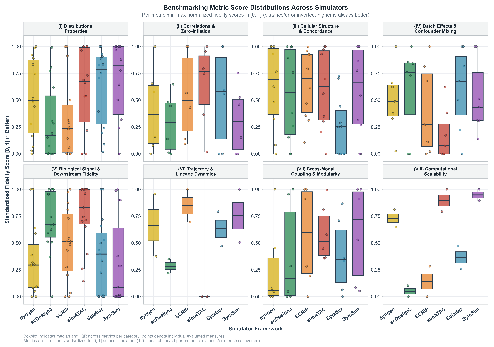

# Plot Comparison Boxplots Across Simulators Plot Benchmark Metric Score Distributions Across Simulators

Generates 600 DPI boxplots with jittered points showing the distribution
of evaluation metric scores across simulated single-cell and multiomics
datasets. Supports standardized direction-aligned fidelity scores (where
higher is universally superior, resolving metric polarity differences
across distance and correlation measures) or original unnormalized raw
values with optional direction separation or per-metric faceting.

## Usage

``` r
plot_metric_boxplots(
  benchmark_data,
  categories = NULL,
  metrics = NULL,
  score_type = c("normalized", "raw"),
  separate_direction = FALSE,
  facet_by = c("category", "metric"),
  palette = NULL,
  ncol = 4,
  base_size = 11
)
```

## Arguments

- benchmark_data:

  A data frame (such as `demo$benchmark_summary_table` or output from
  [`evaluate_simulation_accuracy()`](https://kabilanbio.github.io/scSimEval/reference/evaluate_simulation_accuracy.md))
  or a named list of benchmark result tables.

- categories:

  Optional character vector of categories to include. Default `NULL`
  (all 8 categories).

- metrics:

  Optional character vector of specific metrics to include. Default
  `NULL` (all).

- score_type:

  Character. Score formulation: `"normalized"` (default;
  direction-inverted standardized fidelity scores in \[0, 1\] where
  higher is universally superior across all measures) or `"raw"`
  (unnormalized original metric values).

- separate_direction:

  Logical. When `score_type = "raw"`, whether to separate metrics by
  optimization direction (lower vs higher is better) into distinct
  sub-panels. Default `FALSE`.

- facet_by:

  Character. Facet layout: `"category"` (default; 8 canonical category
  panels) or `"metric"` (independent panels for each individual metric).

- palette:

  Optional named character vector of simulator colors.

- ncol:

  Integer. Number of columns in facet wrap. Default `4`.

- base_size:

  Numeric. Base font size. Default `11`.

## Value

A `ggplot` object.

## Details


